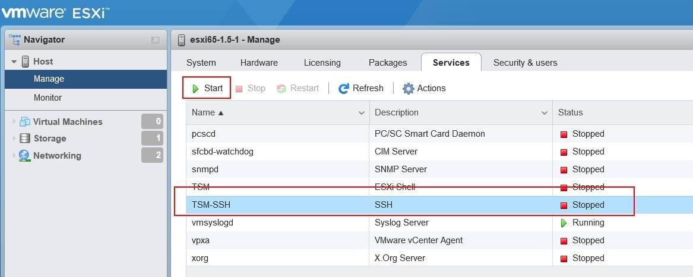
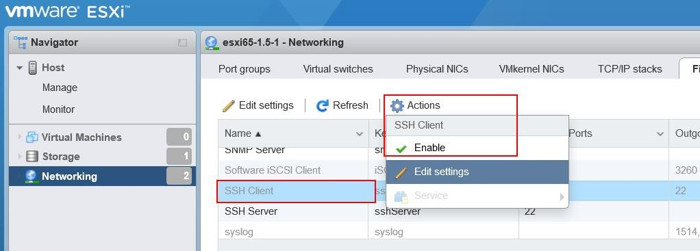
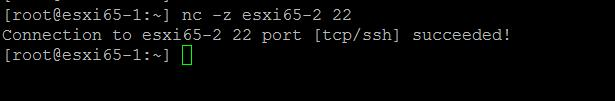

# ESXi-Copy-Files-Between-hosts-using-SCP-Command
<!-- http://www.vmwarearena.com/how-to-copy-files-between-esxi-hosts-using-scp-command/ -->

## Enable SSH and allow SSH in ESXi firewall
Only prerequisite to copy files between ESXi host using SCP command is that both source and destination ESXi host should have SSH enabled and SSH allowed in Firewall. 

Log in to the ESXi Host Client using the below URL https:<ESXi host name or IP>/ui and log in with “root” credentials.

Click on `Manage` under `Host` -> `Services` -> `Select the SSH service “TSM-SSH”` –> `Click on Start` to start the SSH service.

  

Once SSH service is started, We need to allow the SSH Client in ESXi firewall. To allow SSH client in ESXi Firewall, `Click on Networking` -> `Firewall` -> `Select SSH Client` -> `Click on “Enable”` under `Actions Menu`.

  

## Testing SSH Port Connectivity between ESXi hosts
Once SSH service is started and allowed via ESXi firewall on both source and destination ESXi, You can test the connectivity on Port 22 between the ESXi hosts using the below command

nc -Z destination_hostname port number

Example:

nc -Z esxi65-2 22
Connection to destination ESXi host via port 22 is succeeded. We are good to copy files between ESXi host using SCP command.

  

 
